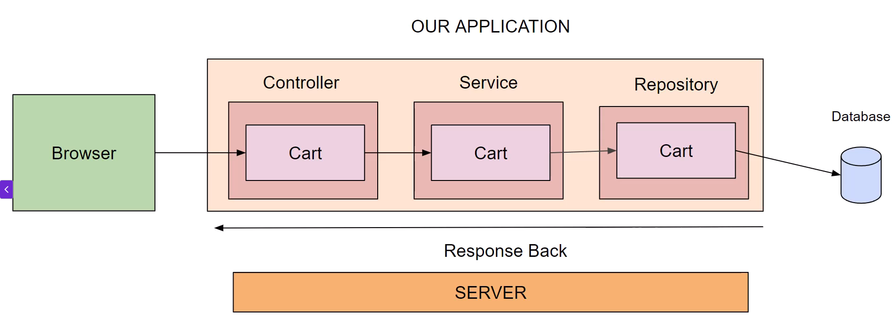
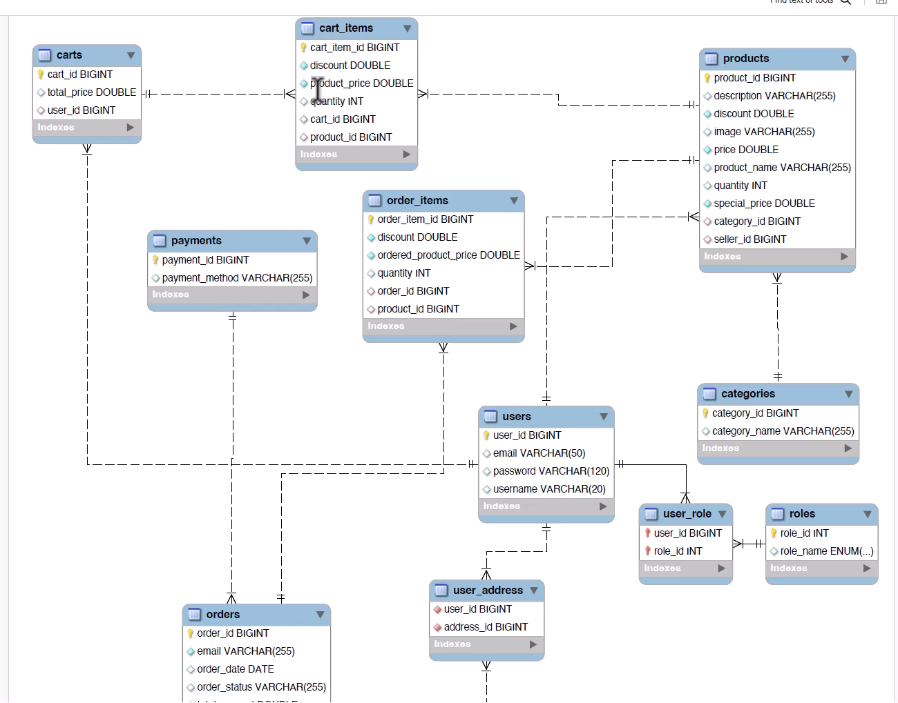

# Notes for Carts Module

### Designing card module



### Card Rest EndPoints


### ER Diagram for users



### Query annotation 
````
**@Query("SELECT c FROM CART c WHERE c.user.email=?1")**

@Query – Lets you define a custom JPQL (Java Persistence Query Language) query for a repository method instead of relying on method-name derivation.

"SELECT c FROM CART c ..." – JPQL statement:

SELECT c → return the entity c.

FROM CART c → CART is the entity class name, not the table name (by JPA convention it should be the class name, e.g., Cart).

c.user.email → navigates the relationship between Cart and User entities to filter by the user’s email.

?1 → positional parameter representing the first method argument.
````


